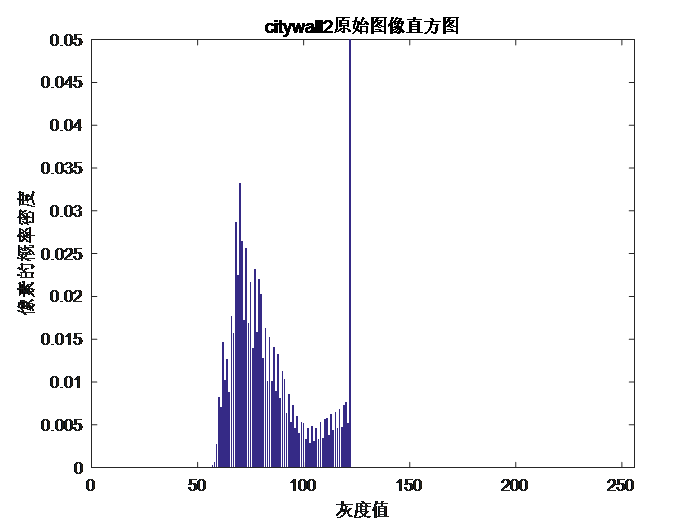
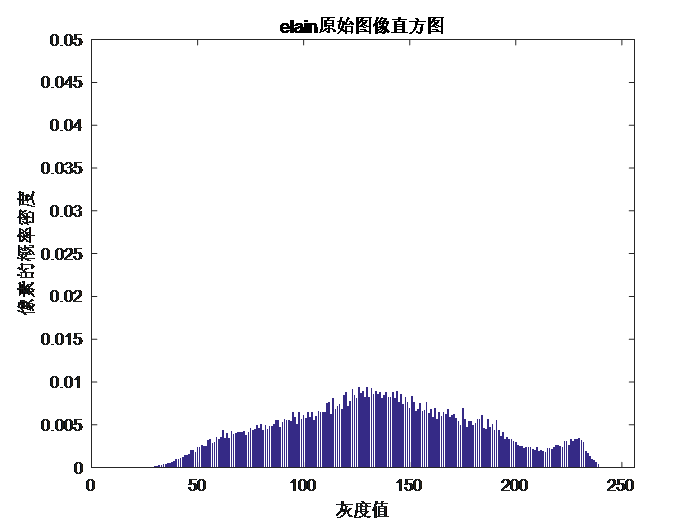
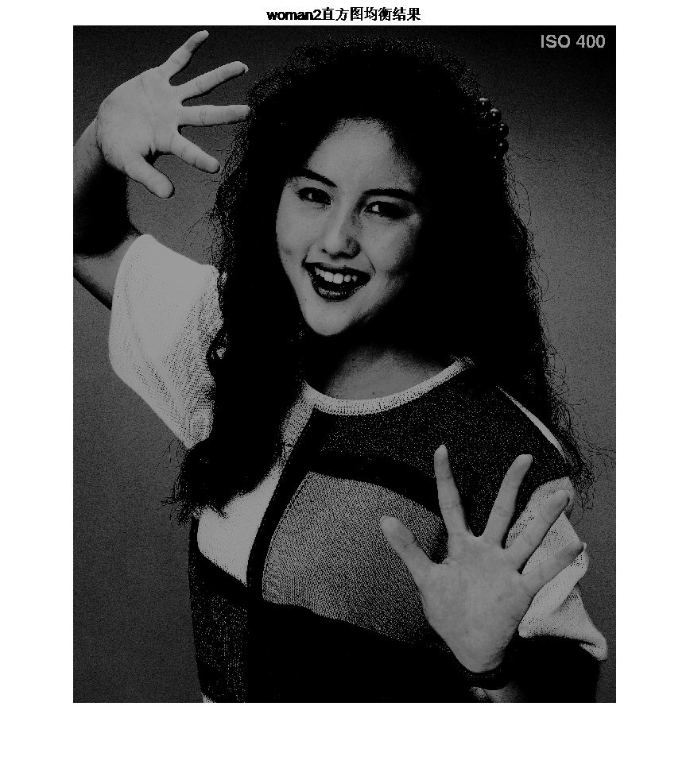

**数字图像处理第三次作业（1-2小题)**

姓名：孔恒

班级：自动化64

学号：2160504095

1.  **把附件图像的直方图画出；**

**问题分析：**强度直方图图形化显示不同的像素值在不同的强度值上的出现频率，对于灰度图像来说强度范围为[0\~255]之间，对于RGB的彩色图像可以独立显示三种颜色的强度直方图。

**处理结果：**

**citywall.bmp**

                     

**elain.bmp**

**lena.bmp**

**woman.bmp**

**结果分析：**本文采用imhist函数求取图像的直方图，MATLAB中imhist会自动把colormap进行线性扩展。将直方图与原始图像对比可以清楚的看到图像的灰度分布与图像直方图之间的关系：在暗图像中，直方图的分量集中在灰度级的低端；亮图像的直方图分量则倾向于灰度级的高端。低对比度图像具有较窄的直方图，且集中于灰度级的中部；高对比度图像中直方图的分量覆盖了很宽的灰度级范围，而且像素的分布没有太不均匀。

**2.把所有图像进行直方图均衡；输出均衡后的图像和源图像进行比对；分析改善内容；**

**问题分析：**直方图均衡化就是对图像进行非线性拉伸，重新分配图像像素值，使一定灰度范围内的像素数量大致相同。

**处理结果：**

**citywall.bmp**

**lena.bmp**

**elain.bmp**

**woman.bmp**

**结果分析：**经过处理得到若干组每组四幅图像，每组中四幅图像分别为原始图像、直方图均衡化后的图像、原始图像的直方图以及均衡化后图像的直方图。从直方图上可以观察到灰度分布确实更加均匀并且占据整个灰度级范围；从图像上可以观察到，图像对比的变大，灰度色调变化范围加大。同时，也注意到有些图像的均衡效果不是很好。直方图均衡并不是适用于所有的图像，需要分情况处理。直观上，可以得出这样的结论：若一幅图像的像素倾向于占据整个可能的灰度级并且分布均匀，则该图像会有高对比度的外观并展示灰色调的较大变化。最终效果将是一幅灰度细节丰富且动态范围较大的图像。
