**数字图像处理第三次作业**

姓名：孔恒

班级：自动化64

学号：2160504095

**3、进一步把图像按照对源图像直方图的观察，各自指定不同源图像的直方图，进行直方图匹配，进行图像增强；**

**问题分析：**

直方图匹配：对两个直方图都做均衡化，变成相同的归一化的均匀直方图，以此均匀直方图为媒介，再对参考图像做均衡化的逆运算。

**处理结果：**

**citywall1.bmp**

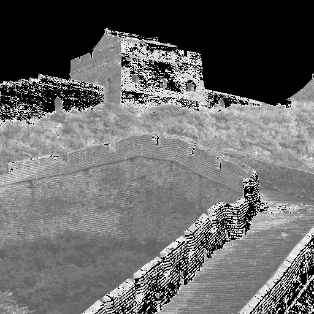

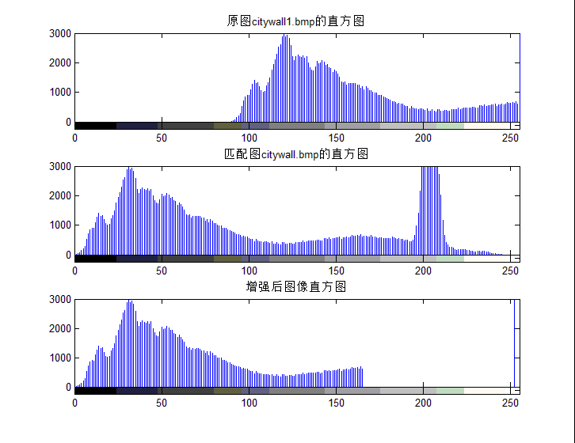

**citywall2.bmp**

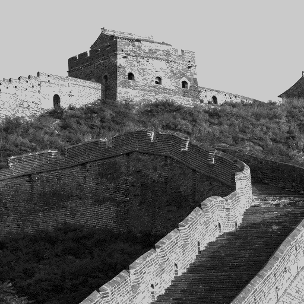

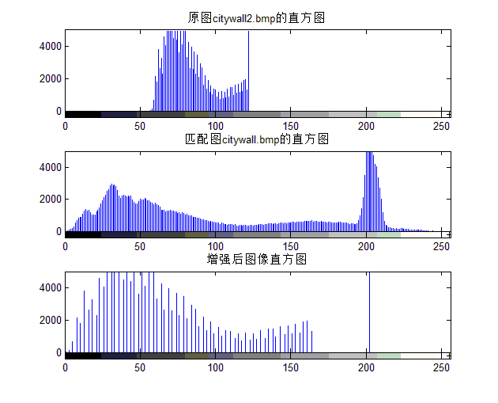

**elain1.bmp**

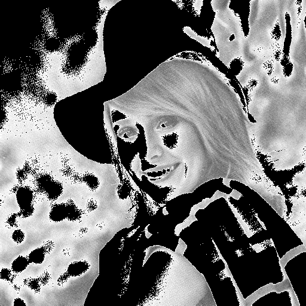

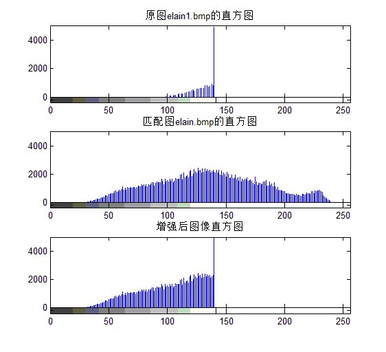

**elain2.bmp**

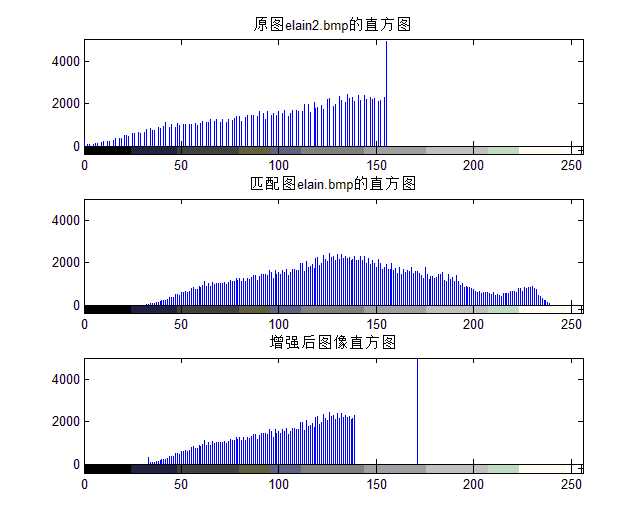

**elain3.bmp**

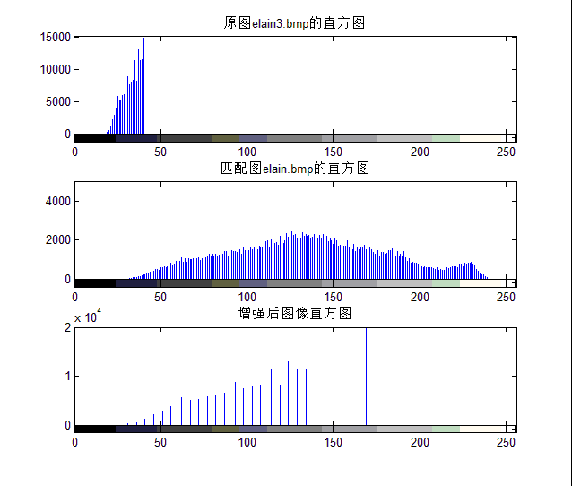

**lena1.bmp**

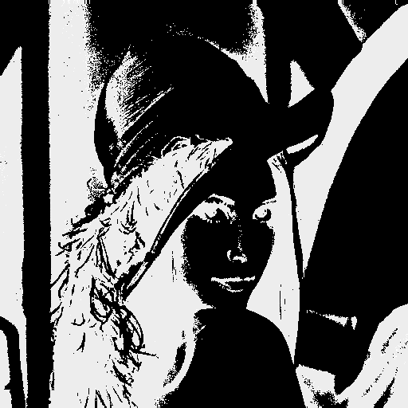

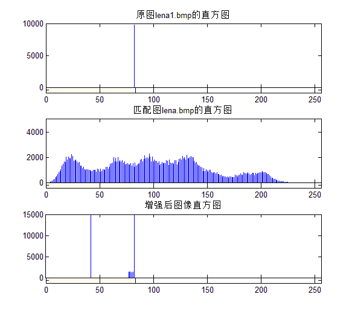

**lena2.bmp**

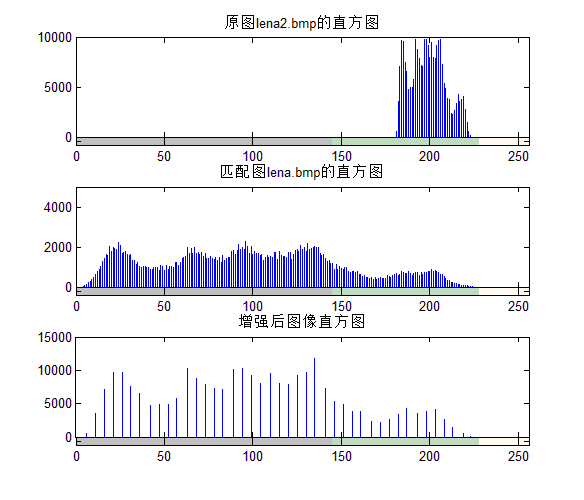

**lena3.bmp**

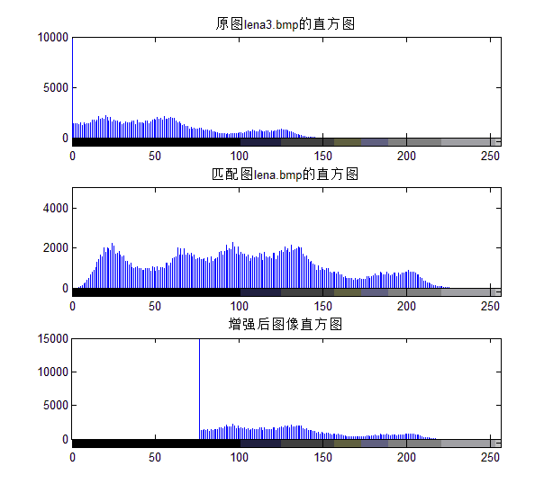

**woman1.bmp**

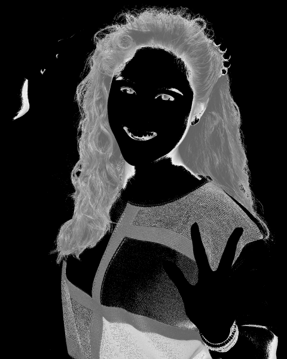

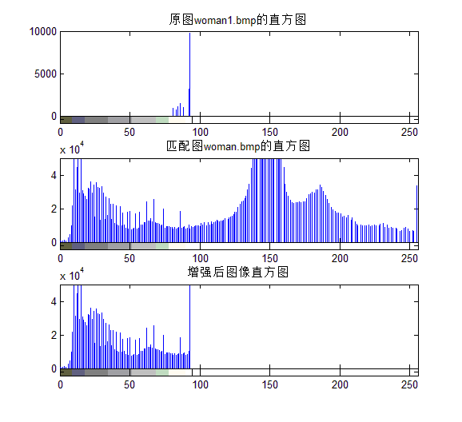

**woman2.bmp**

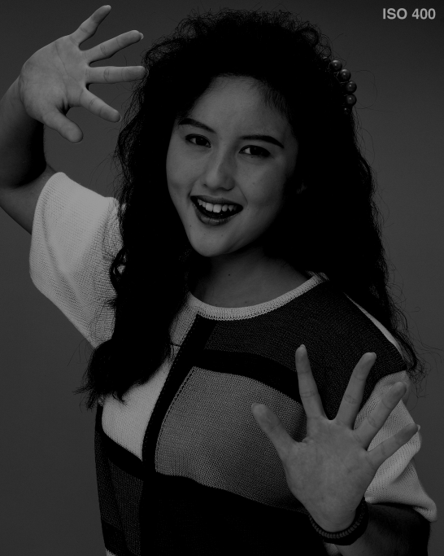

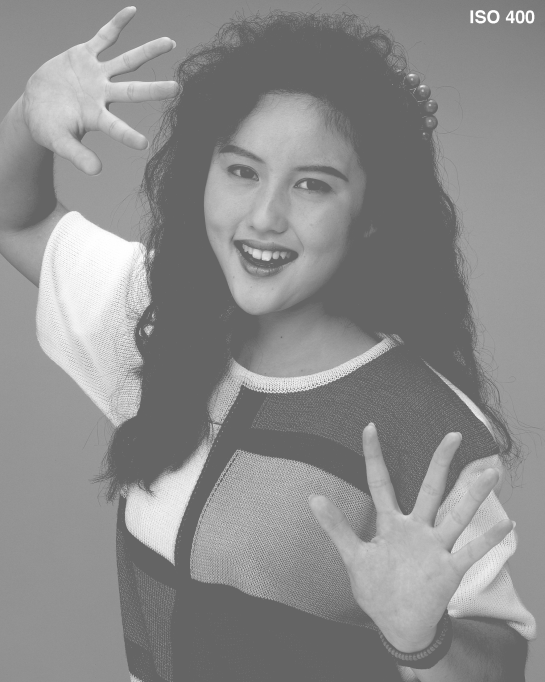

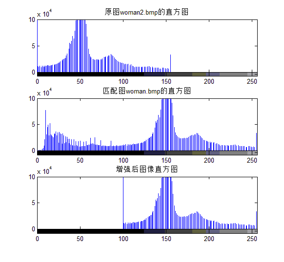

**结果分析：**对比原始图像的直方图、匹配图的直方图以及增强后图像的直方图可知，程序基本达到了直方图匹配的要求，但原始图像直方图和匹配后图像的直方图并没有完全一致。可能的原因有：原始图像中多个灰度值映射到增强后图像的同一个灰度值；离散量的舍入误差。

**4、对elain和lena图像进行7\*7的局部直方图增强；**

**运行结果：**

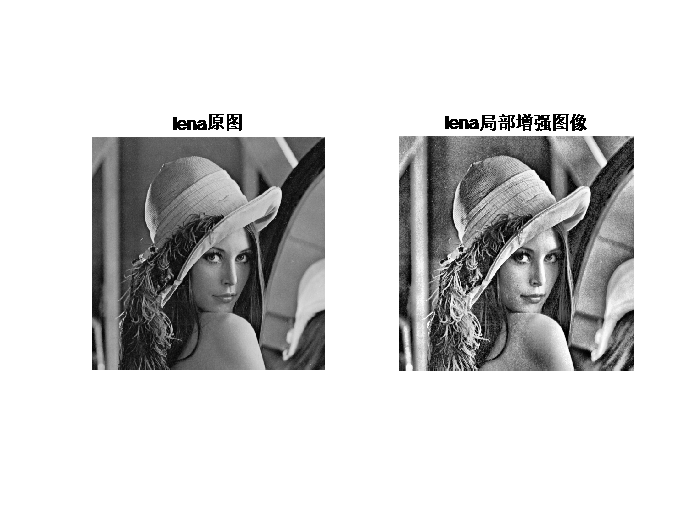

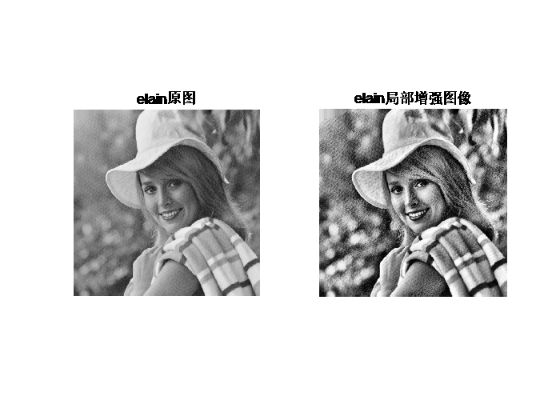

**5、利用直方图对图像elain和woman进行分割。**

**问题分析：**直方图分割的阈值方法的原理是，如果图像所包括的背景区域与所分的目标区域大小可比，而且两者在灰度上有着明显的去表，那么这样的图像的灰度上有着明显的去表，那么这样的图像的灰度直方图就会呈现很明显的双峰状；其中一个峰值对应的应该是背景区域的灰度；而另一个峰值对应的就是目标灰度了；理想中的图像的灰度直方图，其背景灰度和目标灰度应对应两个不同过的灰度峰值，所以选取位于两峰之间的谷值作为阈值，就很快地将一副图像的背景与目标分割开了。

**处理结果：**

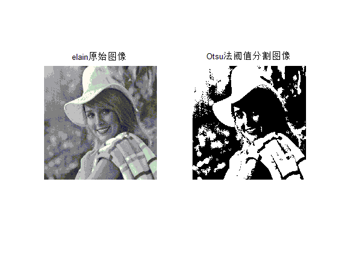

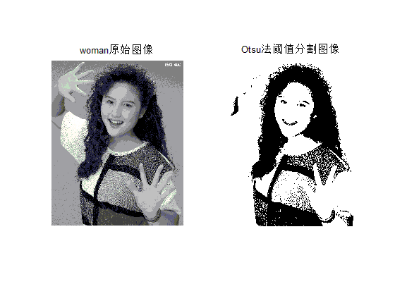

**结果分析：**原始图像与分割后的图像对比看，调用MATLAB中的函数基本达到了对图像进行分割的目的。
